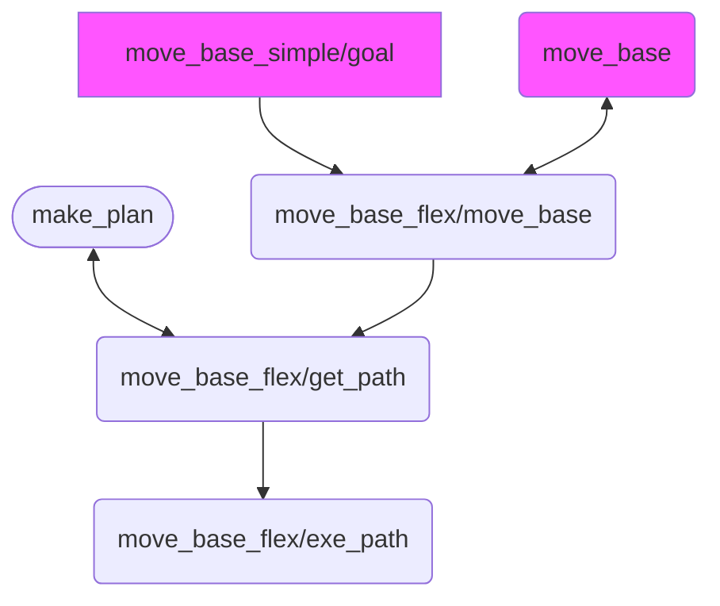

# Husky Mesh navigation

This package is a working simulation of [mesh navigation](https://github.com/uos/mesh_navigation) which uses [move_base_flex](https://github.com/magazino/move_base_flex) for husky.

## Installation

git-lfs: `sudo apt install git-lfs`

Husky simulation: `git clone https://github.com/husky/husky noetic-devel`
`git clone https://github.com/husky/husky_robot noetic-devel` **or any modified version of the husky packages**

move_base_flex: `sudo apt install ros-noetic-move-base-flex`

mesh_navigation: `sudo apt install ros-noetic-mesh-navigation ros-noetic-rviz-map-plugin`

It uses git lfs to store binary files.


## Simulation

Start simulation: `roslaunch husky_mesh_nav sim.launch`

Start mesh nav server: `roslaunch husky_mesh_nav move_base_flex.launch`

To start the navigation you should publish on topic `/move_base_flex/move_base/goal` _(for some reason the topic used on the pluto robot repo is `/move_base_flex/get_path/goal` which only generates the global path but doesn't actually transfer the result to the local planner. Please read the [move_base_action.cpp of move_base_flex](https://github.com/magazino/move_base_flex/blob/master/mbf_abstract_nav/src/move_base_action.cpp) to understand how the informations are transfered in the navigation stack)_

Also, you can simply do: `roslaunch husky_mesh_nav start_experiment.launch`.

## Files and maps for the simulation

The map is from the [repo of the pluto robot](https://github.com/uos/pluto_robot) and most of the files in this repo are from one of those four repos :

- [pluto robot](https://github.com/uos/pluto_robot) : the maps and the mesh_navigation yaml config
- [mesh navigation](https://github.com/uos/mesh_navigation)
- [move_base_flex](https://github.com/magazino/move_base_flex)
- [turtlebot3_mbf](https://github.com/Rayman/turtlebot3_mbf) : the idea and the launch file for the simulation

## Fake odom

By default, it uses the published odom by the husky package. If you experience troubles, for instance robot
slipping on the terrain, you can try to use the odom provide by the gazebo simulation. To do so :

- Add the following code to husky_description/urdf/husky.urdf.xacro
```xml
  <gazebo>
    <plugin name="p3d_base_controller" filename="libgazebo_ros_p3d.so">
      <alwaysOn>true</alwaysOn>
      <updateRate>10.0</updateRate>
      <bodyName>base_link</bodyName>
      <topicName>ground_truth/state</topicName>
      <gaussianNoise>0.01</gaussianNoise>
      <frameName>world</frameName>
      <xyzOffsets>0 0 0</xyzOffsets>
      <rpyOffsets>0 0 0</rpyOffsets>
    </plugin>
  </gazebo>
```
- Set `fake_pos` arg to `true`

If you have trouble with TF odom -> base_link not published enough or too much, tweak the `updateRate` param.

## Real world example

For the proof of concept in the real world, start `base_u2is.launch`, `move_base_flex.launch` et `start_experiment_grand_hall.launch`.

_Note that the base_u2is.launch publishes a TF between map and odom. You should deactivate other nodes that publish 
such TF_

### Files and maps for the real world

- The base_u2is.launch is a modified version of the one from [husky_robot](https://github.com/husky/husky_robot)
- The map was made using a ZED camera 

## Graph



Square : topic, rounded corner square : action server, rounded side square : service server

In purple the action/service/topic created by move_base_legacy_relay (pkg mbf_costmap_nav: script/move_base_legacy_relay.py). Others are created by mbf_abstract_nav.

<br/>
<br/>
<br/>

Assembled by Sébastien K. for CoHoMa 2023 - U2IS Team.
